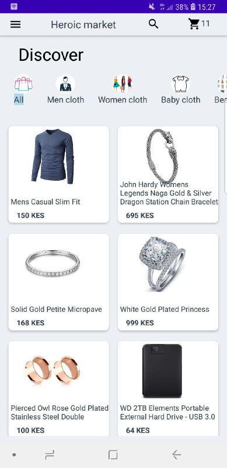

#Heroic market app

This is an ecommerce mobile application for buying and selling products online, 
built using the Volley library for Android and Laravel for the backend technology.
I have created  API endpoints that allows one to fetch all items, items categories, 
register a user and add items to cart.
I have integrated the app with mpesa to provide an alternative payment option

#Features

Fast and efficient network communication using the Volley library.
Secure payment processing using mpesa.
User authentication and authorization using Laravel.
Product listing, browsing, and search functionality.
Shopping cart and order management.
Admin dashboard for managing products, orders, and users.

#screens

<table>
	  <tr>
		 <td>Welcome screen</td>
		  <td>All items</td>
		  <td>single category</td>
	  </tr>
	  <tr>
		 <td></td>
		 <td></td>
		 <td></td>
	  </tr>
	 </table>

<table>
	  <tr>
		 <td>Product details</td>
		  <td>Search</td>
		  <td>Products cart</td>
	  </tr>
	  <tr>
		 <td></td>
		 <td></td>
		 <td></td>
	  </tr>
	 </table>

#Requirements

Android Studio
PHP 7+ and composer for Laravel

#Installation

Clone the repository.
Set up the Laravel backend by following the instructions in the backend directory.
Open the Android project in Android Studio and build the app.

#Usage

Run the Laravel backend server.
Install the app on an Android device or emulator.
Log in or create an account to start browsing and buying products.
Contributions
Contributions are welcome. Please create a pull request for any changes or improvements.

#License

This project is licensed under the MIT license.

