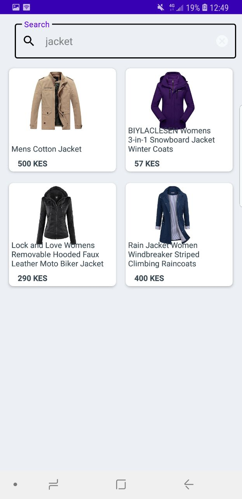

# Heroic market app

-This is an ecommerce mobile application for buying and selling products online, 
built in java  and Laravel for the backend technology.
-I have created  API endpoints that allows one to fetch all items, items categories, 
register a user and add items to cart in laravel.
-The app is using  the volley library which provides easy and fast network communication between the  Android app and the backend
-The app integrated the app with mpesa to provide an online  payment option

## Features

-User authentication and authorization using Laravel.
-Product listing, browsing, and search functionality.
-Shopping cart and order management.
-Secure payment processing using mpesa.

## screens

<table>
	  <tr>
		 <td>Welcome screen</td>
		  <td>All items</td>
		  <td>single category</td>
	  </tr>
	  <tr>
		 <td></td>
		 <td></td>
		 <td></td>
	  </tr>
	 </table>

<table>
	  <tr>
		 <td>Product details</td>
		  <td>Search</td>
		  <td>Products cart</td>
	  </tr>
	  <tr>
		 <td></td>
		 <td></td>
		 <td></td>
	  </tr>
	 </table>

## Requirements

-Android Studio
-PHP 7+ and composer for Laravel

## installation

-Clone the repository.
-Set up the Laravel backend by following the instructions in the backend directory.
-Open the Android project in Android Studio and build the app.

## usage

-Run the Laravel backend server.
-Install the app on an Android device or emulator.
-Log in or create an account to start browsing and buying products.

## contributions
Contributions are welcome. Please create a pull request for any changes or improvements.

## license

This project is licensed under the MIT license.

